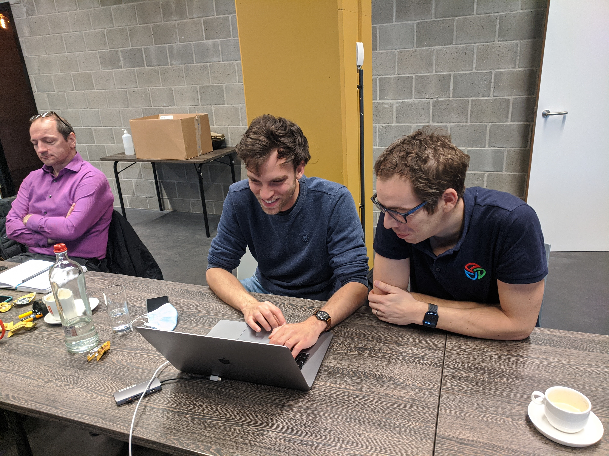

# My first year at Triple D

In February 2022 year I joined Triple D and as my first year as employee is coming to an end I will use this as an opportunity to tell what it's like to join and be part of this company.
It has been an amazing first year for me, and I hope everything below will show you why.
I will start by providing some context on where I was professionally before I joined Triple D, what the recruitment process was like and how it's been so far.

## About me

I am currently 31 years old, have spent 4 years teaching software development and 3 years actually doing it.
A bit over a year ago I was working at a large service provider.
I already had a starting notion of clean code, TDD, architecture,... 
In the interview for that job, they asked me what I knew about DDD, microservices, and other techniques or technologies that piqued my interest.
I reasoned that if they want to know how knowledgeable I am about these subjects, they must be using them in practice! 
While there was some truth to that, reality fell short of what I had imagined beforehand.
There was the notion that things could and should be done better, but there was never time nor budget to actually make the required changes. 
This became increasingly frustrating and eventually led me to look for a new job elsewhere.

## Triple D

I had found Triple D before when looking for people or companies focussed on software craftsmanship, but then it was in the context of finding speakers for a teaching session at the university college I worked for. 
Now I was looking for a job for myself and immediately thought of Triple D again.
There were two quotes on their homepage that spoke to me:

> “We” are a group of veteran software engineers with the aim of having a _larger, positive impact_ on the Belgian software industry.

>A challenging job well done, that is what we aim for.

These two quotes perfectly captured what I was looking for: people that do not want to just do their job, they want to do it well _and_ they aim to spread the knowledge they have. 
That second part hit home for me as I was a teacher before and always hoped to retain some teaching aspects in a future job.

## Applying at Triple D

I emailed them explaining the frustration at my current job, my ambition of being a better developer, and how perfectly Triple D's mission statement matched that ambition.
I quickly received a reply and an initial online meeting was set up.
There we discussed more in-depth what both myself and Triple D were looking for.
As I had hoped, this was a match, and we scheduled an IRL interview.

This was not a typical interview. 
Me, Guido and Domenique spent an entire day together, evenly split between paired coding sessions and talking.
We went through a code kata and this in itself was already an eye-opening experience.
It quickly became clear that while I knew some things already, there was so much more to learn.
And these people knew exactly those things!
They showed me in a very clear way that they appreciated what I already knew but also pointed me to where the holes in my knowledge were.
During the time not spent coding, we discussed the state of the industry, shared frustrations, what Triple D aims to do about those frustrations, their vision, what my role could be, and much more. 
The relaxed and down-to-earth attitude Guido and Domenique had throughout this day put me at ease and allowed me to show the best version of myself.

They also invited me to one of their Triple Dojo Days.
These are day-long gatherings of like-minded people socializing, discussing and learning from each other.
Getting to know the rest of the team was great, and meeting other people from the community was a pleasant experience.

A day or two after the interview they provided me with feedback on how they experienced the interview and what they thought of me. 
They liked my attitude and while there was still much I did not know, they saw how motivated I was to learn.
Not much later they made an offer I couldn't refuse, and we decided on february 1st being my first day working for Triple D.

## My first month at Triple D

I spent my entire first month at Triple D learning.
Together with Guido, Kris and Doménique I deepened my knowledge of TDD, DDD, (clean) architecture, refactoring, and learned new things such as Event Storming and Domain Storytelling.
We used the [Agile Technical Practices Distilled](https://leanpub.com/agiletechnicalpracticesdistilled) book as a guide for most of it, but they provided me with other books such as [Domain Driven Design Distilled](https://www.oreilly.com/library/view/domain-driven-design-distilled/9780134434964/) and [Implementing Domain Driven Design](https://www.oreilly.com/library/view/implementing-domain-driven-design/9780133039900/). 
You don't learn just by reading of course, so all this was supplemented with plenty of time pairing on katas and a larger project.

Having an entire month dedicated to just learning is an amazing thing in and of itself, but having experts on the subject matter directly available is a great boon on top of that. 
It allowed me to quickly ask for clarification when something wasn't clear and avoided learning incorrect interpretations of new concepts.

## My first client

After the initial month of intensive learning, I started at my first client.
Triple D would have liked to place me with a client together with a Triple D colleague but sadly that wasn't possible.
The client I'm working at is an old client of theirs: a couple of years ago two-three people worked there. 
Triple D knew this client would be a good fit because they are very open to improvements (in contrast with my previous employer).
This means they had a good idea of who was working there, what they were working on, and what the struggles were.

It soon became clear that there were plenty of opportunities to bring my upgraded skills into practice.
Under the guidance of both Triple D and my new colleagues, I was given full support when I saw opportunities for improvement.
This has by now allowed me to take up ownership of multiple small to medium-sized refactors.
I try and do and learn as much as possible by myself, knowing that I can always fall back on the knowledge of my colleagues at Triple D when I reach my current limits.

## Personal Development

The text above should already show you how well-supported I've been on my learning path.
In addition to the day-to-day support, Triple D has also sent me to [DDD Europe](https://dddeurope.com/), the [Socrates Conference](https://socratesbe.org/) and has provided me with plenty of budget to purchase access to other sources of information.

They have met my expectations when it came to helping me reach my full potential, and I'm confident that they will continue to do so.

## Conclusion

I realise that most of what I have written can be interpreted as propaganda for my employer.
There's some similarities with what a new consultant would write a couple of months after signing their contract with your typical run-of-the-mill constultancy company: "Everything is great here!", "The people are amazing!", "My company car is so shiny!".

My point is that I'd do Triple D a major disservice by putting them in the same category as those compagnies.
Those wouldn't provide the level of commitment and support Triple D has given me.
They wouldn't communicate with the same amount of transparancy.
They wouldn't allow me to reach my full potential, and for me that is what matters.
