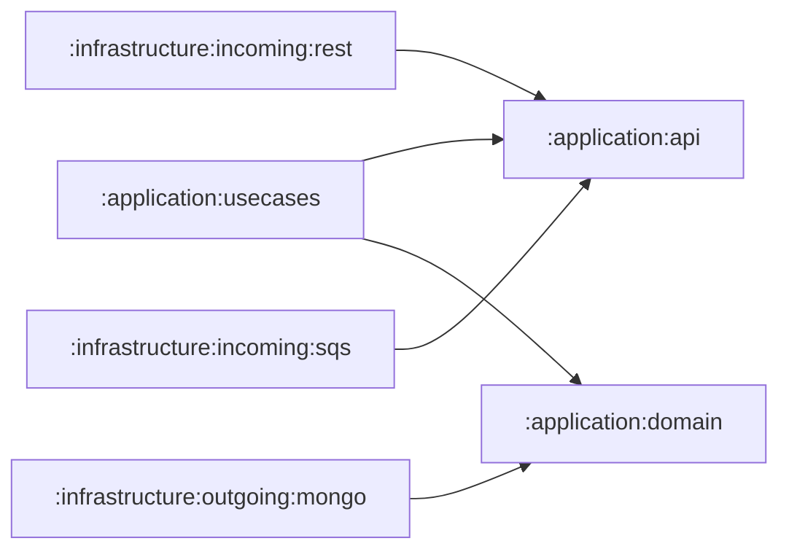

In this blog post we'll give an overview of what we at Triple D consider a decent 'default' architecture for domain-heavy projects.
For this we combine several best practices.
It is in no way a one-size-fits-all solution, as that just does not exist.
Vaugh Vernon puts it nicely in his book "Implementing Domain Driven Design":
> The real demands for specific software qualities should drive the use of architectural styles and patterns.
> The ones chosen must be proven to meet or exceed required qualities.
> We must be able to justify every architectural influence in use, or we eliminate it from our system.

# Overview

Aanpak: gaandeweg opbouwen

1. Hexagonal Architecture
2. DDD (+ vocabulary?)
3. Event-Driven
4. CQRS / BFF
5. Scenario Testing
6. Snapshots

Voor elk hoofdstuk:
* Uitleg concept
* Uitwerking
* + en -
* What's missing = introductie naar een volgende sectie

# Hexagonal Architecture / Ports and Adapters

> Allow an application to equally be driven by users, programs, automated test or batch scripts, and to be developed and tested in isolation from its eventual run-time devices and databases. (https://alistair.cockburn.us/hexagonal-architecture/)
https://herbertograca.com/wp-content/uploads/2018/11/080-explicit-architecture-svg.png

## Uitwerking
Project module gradle structuur, met dependencies aangeduid.
Eerst folderstructuur, dan ook grafe met gradle dependencies.

Configurable dependency pattern

## Pros and cons

The advantage of encoding the architecture into Gradle modules is that there is no way a developer could write compileable code that creates dependencies which are not allowed by the dependency graph above.
The IDE would not even autocomplete statements, so a (junior) developer is protected by the dependencies enforced by the build system.

+ testability
+ straightforward on where to put everything ("if I can autocomplete it, I can use it")
- mapping(?) provide counterpoint

## What's missing

Hexagonal architecture shows us how to structure our code on a high level, putting the most important part, our application/business code at the very core. It does however not give any guidance on how to structure what's inside.
There's usecase classes calling domain classes and that's about it.
In the next section we look at Domain Driven Design to guide us.

# Tactical Domain Driven Design

The goal of Domain Driven Design (DDD) is to find a language that works both for the domain experts and the developers.
// TODO: explain shortly the difference between tactical vs strategical
With it, Tactical DDD brings concepts such as aggregates, entities, value objects,,... which will be the building blocks of hexagon.

## Uitwerking

## Pros and cons

## What's missing

# Event-Driven Architecture

Event-Driven Architecture (EDA) is an architectural paradigm in which events are both consumed and produced throughout regular application flow.
It is inherently asynchronous and allows for loosely coupled components.
It plays very nicely with the domain events inherent to DDD.
TODO: also commands, not just events. Events can trigger commands through a policy.

## Uitwerking
The events and commands originating from our application have to reach all those who want to listen to them. This can be the application itself, applications in other bounded contexts, or event entirely other systems.
As we are working in a hexagonal architecture, how these events flow through the application is important as well.

![[Pasted image 20241113162944.png]]

![[Screenshot 2024-11-13 at 16.30.10.png]]

![[Screenshot 2024-11-13 at 16.30.37.png]]

Application Policies, delivery mechanisms (at least once, exactly,...). Outbox pattern, intermediate models (Domain Event, Cloud Event,...), Command bus
Application policy transactional and using queries to fetch what is needed

Diagram met de mapping tussen de ports/adapters.
Diagram met flow van events  + rol van application policies (link naar blogpost event storming a restaurant)

## Pros and cons
Consideration: event module or just part of :application:domain?

+ application logic comprised of smaller, easier to grasp reactions to events. Makes it easier to know where change needs to happen
+ Scales nicely
+ Loose coupling
- harder to debug: long flows ( TODO naam opzoeken (saga?)) can be hard to follow.
- asynchronous processing can be hard to reason about

## What's missing

Not per se what is missing, but an opportunity: by having events we can build projections of our state in the most useful way for our FE queries.
We decouple this projection from our regular flow -> CQRS.

# CQRS / BFF

Query logic for a FE can become cumbersome to write + decouple application load from query load.

## Uitwerking
Use of Elastic + projections (trigger by domain events)

Ook sequence diagram oid om flow van upserted/deleted event naar policy naar upsertToFEcommand te werken.

## Pros and cons

+ decoupling between FE and BE. FE queries have no impact on load of BE, can scale separately.
+ FE has purpose-built models, reduces need for mapping logic or combining of models on FE.
+ Elastic has built-in indexing, searching, filtering, sorting,... No need to write that tedious code yourself. (Buy it, don't build it)
- extra infrastructure required for BFF

## What's missing

# Snapshots

## Uitwerking

## Pros and cons